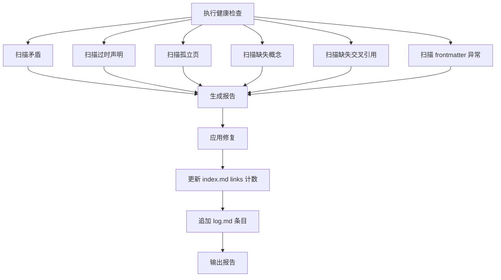

# LLM Wiki — 健康检查

## 概述

系统扫描 wiki 的健康状况，发现并修复问题。保持 wiki 随规模增长而持续健康。

## 工作流



## 检查项

### 1. 矛盾检测

扫描所有 `wiki/` 页面，查找对同一事实的不同说法。

**方法：** 对比同一概念/实体在不同页面中的描述。关注：
- 日期、数字、数据等可量化事实
- 定义性陈述（"X 是一种..."）
- 因果关系描述

**发现矛盾后：** 在相关页面顶部添加 `⚠️ 矛盾` 标注，列出双方及来源。

### 2. 过时声明

当新源覆盖或修正了旧信息时，旧页面可能包含过时声明。

**方法：** 对比 `wiki/sources/` 摘要页的时间戳和相关页面的引用。如果一个概念页引用了旧源但没有引用新源，标记为可疑。

**处理：** 在旧页面顶部添加：

```
> [!NOTE] 此页信息已被 [新页面](../wiki/sources/新摘要页.md) 更新/修正
```

### 3. 孤立页

入链数为 0 的页面（不被任何其他页面引用）。

**方法：** 对每个 `wiki/` 下的页面，统计被其他页面以相对链接方式引用的次数。

**处理：**
- 如果页面确实有价值，在其他相关页面添加引用
- 如果页面是冗余的，考虑合并或删除
- 如果是新建页面刚创建，标记为"发展中"，稍后复查

### 4. 缺失概念

经常被提及但没有独立页面的概念。

**方法：** 在多个页面中扫描被提及的术语、模式、原理，检查是否已有对应的 `wiki/concepts/` 页面。

**处理：** 对跨页面出现 3 次以上的未创建概念，建议创建独立页。

### 5. 缺失交叉引用

页面之间存在明显关联但互相没有链接。

**方法：** 扫描概念页中的"关联概念"段落，检查这些概念是否确实有页面且被相互引用。

### 6. Frontmatter 异常

**检查：**
- `links` 计数与实际入链数不一致 → 更新
- `sources` 列表中引用的源文件是否仍然存在
- `updated` 日期是否合理

## 报告格式

```markdown
## LLM Wiki 健康报告
日期: YYYY-MM-DD

### 概况
- 总页面: N
- 总源: N

### 发现
- ⚠️ 矛盾: N 处
  - 概念 X: 页面 A 说 ...，页面 B 说 ...
- 📌 过时声明: N 处
  - 页面 C 未反映新源 D 的信息
- 📭 孤立页: N 页
  - page.md (创建于 YYYY-MM-DD)
- 💡 建议创建: N 个概念
  - "概念名"(出现在 X、Y、Z 页面)
- 🔗 缺失引用: N 处
- 📋 Frontmatter 问题: N 处

### 已执行修复
- 更新了 N 个页面的 links 计数
- 添加了 N 处矛盾标注
- 添加了 N 处过时标注

### 建议
- 新源推荐: [查找方向]
- 新问题推荐: [可深入的问题]
```

## 快速参考

| 指标 | 健康 | 需关注 | 危险 |
|------|------|--------|------|
| 孤立页占比 | <10% | 10-25% | >25% |
| 矛盾数 | 0 | 1-3 | >3 |
| 过时声明 | 0 | 1-3 | >3 |
| page links 准确率 | >90% | 70-90% | <70% |

## 常见错误

| 错误 | 正确做法 |
|------|----------|
| 只报告不修复 | 发现能自动修复的问题立即修复（links 计数、缺失引用） |
| 忽略新建页面 | 新页面刚创建时入链为 0 是正常的，别标记为孤立 |
| 建议创建页面但后续不执行 | 建议必须附带执行，当下就创建 |
| 更新 index 不更新 log | 每次 lint 必须记录 log |

## 交叉引用

- [llmwiki-ingest](../llmwiki-ingest/SKILL.md) — 摄入新源
- [llmwiki-query](../llmwiki-query/SKILL.md) — 查询 wiki 内容
- [AGENTS.md](../../AGENTS.md) — 完整的行为规范
