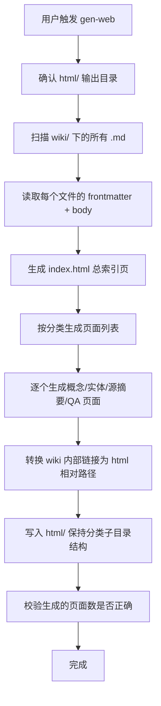

# LLM Wiki — 静态网站生成

## 概述

将 `wiki/` 下的所有 markdown 页面编译为一个学术风简洁的静态 HTML 网站，输出到项目根目录的 `html/`。每次调用重新生成全站，保持与 wiki 内容同步。

## 工作流



## 设计规范 — 学术风简洁

### 视觉基调

- **排版优先**: 正文 Georgia / "Noto Serif SC" 衬线字体，标题 Inter / system-ui 无衬线
- **阅读宽度**: 内容区 max-width 720px，居中
- **行距**: 1.7-1.8，段间距 1.5em
- **字号**: 正文 16-17px，标题按层级递减
- **色彩**: 黑色文字 #1a1a1a，背景 #fafaf8（暖白），链接 #2563eb（蓝），点缀色用于标签
- **留白**: 充足的 padding 和 margin，呼吸感

### 布局结构

```
┌─────────────────────────────┐
│  header: 站点名 + 面包屑     │
├─────────────────────────────┤
│  main: 内容区 (max 720px)    │
│   ├─ h1 (页面标题)           │
│   ├─ .meta (标签/日期/源)    │
│   └─ .content (markdown 渲染)│
├─────────────────────────────┤
│  footer: 返回首页            │
└─────────────────────────────┘
```

### 分类页面

| 分类 | 目录 | 说明 |
|------|------|------|
| 首页 | `wiki/_index_.md` | → `html/index.html` |
| 概念 | `wiki/concepts/*.md` | → `html/concepts/*.html` |
| 实体 | `wiki/entities/*.md` | → `html/entities/*.html` |
| 源摘要 | `wiki/sources/*.md` | → `html/sources/*.html` |
| QA | `wiki/qa/*.md` | → `html/qa/*.html` |

## 实现方式

### 生成脚本

使用 skill 自带的 `gen-web.js`（v3 并行优化版）：

```bash
# 在项目根目录执行
node .skills/llmwiki-gen-web/gen-web.js
```

脚本处理所有步骤：扫描 wiki/ → 解析 frontmatter → marked 转 HTML → 注入学术风模板 → 转换内部链接 → 写入 html/。

### 性能优化

| 优化 | v2 → v3 | 效果 |
|------|---------|------|
| marked 调用 | `npx marked` 逐文件 spawn → `import('marked')` 库调用 | 消除 ~300ms/页 的子进程开销 |
| 页面生成 | 串行 for 循环 → `Promise.all` 并发池 | CPU 密集任务按 `os.cpus()-1` 并行 |
| 文件读写 | `readFileSync` 串行 → `fs.promises` 异步并行 | I/O 不阻塞渲染 |
| 目录创建 | 逐个 mkdirSync → `Promise.all` 批量创建 | 微优化 |

并发数自动取 CPU 核心数 - 1，大站点（100+ 页）收益最明显。

### 数据流

```
wiki/*.md
  │  (并行读取 + frontmatter 解析)
  ▼
marked.parse()        ← import('marked') 库直接调用
  │  (并发池，CPU 核心数 - 1)
  ▼
fixLinks() + 模板注入
  │  (并行写入)
  ▼
html/xxx.html  +  search.json

### 内部链接转换规则

| 原始链接 | 转换后 |
|---------|--------|
| `../wiki/concepts/概念名.md` | `concepts/概念名.html` |
| `../wiki/entities/实体名.md` | `entities/实体名.html` |
| `../wiki/sources/源摘要.md` | `sources/源摘要.html` |
| `../index.md` | `index.html` |
| `../raw/文件名.md` | 保留（指向 raw 目录，不转换） |
| 外部 URL (https://...) | 不变 |

### 页面模板结构

```html
<!DOCTYPE html>
<html lang="zh-CN">
<head>
  <meta charset="UTF-8">
  <meta name="viewport" content="width=device-width, initial-scale=1.0">
  <title>{{title}} — LLM Wiki</title>
  <style>
    /* 学术风 CSS — 内联，无外部依赖 */
    * { margin: 0; padding: 0; box-sizing: border-box; }
    body {
      font-family: Georgia, "Noto Serif SC", serif;
      font-size: 16.5px;
      line-height: 1.75;
      color: #1a1a1a;
      background: #fafaf8;
      padding: 2rem 1rem;
    }
    .container { max-width: 720px; margin: 0 auto; }
    header {
      margin-bottom: 2.5rem;
      padding-bottom: 1rem;
      border-bottom: 1px solid #e0ddd8;
    }
    header h1 { font-family: system-ui, -apple-system, sans-serif; font-size: 1.8rem; font-weight: 600; letter-spacing: -0.02em; }
    header a { color: inherit; text-decoration: none; }
    .breadcrumb {
      font-family: system-ui, -apple-system, sans-serif;
      font-size: 0.85rem;
      color: #6b7280;
      margin-bottom: 0.5rem;
    }
    .breadcrumb a { color: #2563eb; text-decoration: none; }
    .breadcrumb a:hover { text-decoration: underline; }
    .meta {
      font-family: system-ui, -apple-system, sans-serif;
      font-size: 0.85rem;
      color: #6b7280;
      margin-bottom: 2rem;
      display: flex; gap: 0.5rem; flex-wrap: wrap;
    }
    .meta .tag {
      display: inline-block;
      background: #e5e7eb;
      color: #374151;
      padding: 0.1rem 0.5rem;
      border-radius: 3px;
      font-size: 0.8rem;
    }
    .content h2 { font-family: system-ui, -apple-system, sans-serif; font-size: 1.4rem; font-weight: 600; margin: 1.8rem 0 0.8rem; letter-spacing: -0.01em; }
    .content h3 { font-family: system-ui, -apple-system, sans-serif; font-size: 1.15rem; font-weight: 600; margin: 1.5rem 0 0.6rem; }
    .content h4 { font-family: system-ui, -apple-system, sans-serif; font-size: 1rem; font-weight: 600; margin: 1.2rem 0 0.5rem; }
    .content p { margin-bottom: 1em; }
    .content a { color: #2563eb; text-decoration: none; }
    .content a:hover { text-decoration: underline; }
    .content ul, .content ol { margin: 0.5rem 0 1rem 1.5rem; }
    .content li { margin-bottom: 0.3rem; }
    .content code {
      font-family: "SF Mono", "Fira Code", monospace;
      font-size: 0.88em;
      background: #f0efec;
      padding: 0.15em 0.35em;
      border-radius: 3px;
    }
    .content pre {
      background: #f0efec;
      padding: 1rem;
      border-radius: 6px;
      overflow-x: auto;
      font-size: 0.88em;
      margin: 1rem 0;
    }
    .content pre code { background: none; padding: 0; }
    .content blockquote {
      border-left: 3px solid #d1d5db;
      padding-left: 1rem;
      margin: 1rem 0;
      color: #4b5563;
    }
    .content table {
      width: 100%;
      border-collapse: collapse;
      margin: 1rem 0;
      font-family: system-ui, -apple-system, sans-serif;
      font-size: 0.9rem;
    }
    .content th, .content td {
      border: 1px solid #e0ddd8;
      padding: 0.5rem 0.75rem;
      text-align: left;
    }
    .content th { background: #f0efec; font-weight: 600; }
    .content img { max-width: 100%; height: auto; border-radius: 4px; margin: 1rem 0; }
    .content hr { border: none; border-top: 1px solid #e0ddd8; margin: 2rem 0; }
    footer {
      margin-top: 3rem;
      padding-top: 1rem;
      border-top: 1px solid #e0ddd8;
      font-family: system-ui, -apple-system, sans-serif;
      font-size: 0.85rem;
      color: #6b7280;
    }
    footer a { color: #2563eb; text-decoration: none; }
    /* 索引页列表 */
    .page-list { list-style: none; margin: 0; }
    .page-list li {
      padding: 0.6rem 0;
      border-bottom: 1px solid #f0efec;
    }
    .page-list li:last-child { border-bottom: none; }
    .page-list a { font-size: 1.05rem; }
    .page-list .desc {
      font-size: 0.85rem;
      color: #6b7280;
      margin-top: 0.15rem;
    }
    /* 首页特殊 */
    .hero { margin: 2rem 0; }
    .stat { display: inline-block; font-family: system-ui, sans-serif; font-size: 0.85rem; color: #6b7280; margin-right: 1rem; }
    /* 响应式 */
    @media (max-width: 600px) {
      body { padding: 1rem; font-size: 15px; }
      header h1 { font-size: 1.4rem; }
    }
  </style>
</head>
<body>
  <div class="container">
    <header>
      <div class="breadcrumb">
        <a href="index.html">LLM Wiki</a>
        {{breadcrumb}}
      </div>
      <h1><a href="index.html">LLM Wiki</a></h1>
    </header>
    <main>
      {{meta}}
      <div class="content">
        {{content}}
      </div>
    </main>
    <footer>
      <a href="index.html">← 返回首页</a>
    </footer>
  </div>
</body>
</html>
```

### 索引页 index.html 特殊处理

首页（从 `wiki/_index_.md` 生成）额外包含从 `index.md` 解析的总览表格：

```html
<!-- 首页英雄区 -->
<div class="hero">
  <span class="stat">📄 源文档: {{sourceCount}}</span>
  <span class="stat">📖 Wiki 页面: {{pageCount}}</span>
  <span class="stat">📅 更新: {{updateDate}}</span>
</div>

<!-- 分类列表 -->
<h2>概念 ({{conceptCount}})</h2>
<ul class="page-list">
  {{#each concepts}}
  <li><a href="concepts/{{slug}}.html">{{title}}</a><div class="desc">{{summary}}</div></li>
  {{/each}}
</ul>
<!-- 同理: 实体、源摘要、QA -->
```

## 执行方式

使用 skill 自带的生成脚本：

```bash
# 在项目根目录执行
node .skills/llmwiki-gen-web/gen-web.js
```

该脚本处理所有步骤：扫描 wiki/ → 解析 frontmatter → marked 转 HTML → 注入学术风模板 → 转换内部链接 → 写入 html/。脚本位于 skill 目录中，与 SKILL.md 一并版本化，确保每次生成风格一致。

## 增量策略

- 每次 `gen-web` 调用**重新生成全站**（wiki 页面数量少，全量生成开销可忽略）
- 生成后打印页面数和文件大小统计
- 将 `html/` 加入 `.gitignore`（生成物不进版本控制）

## 常见错误

| 错误 | 正确做法 |
|------|----------|
| wiki 内部链接没转换 | 所有 `../wiki/concepts/xxx.md` 必须变为 `concepts/xxx.html` |
| frontmatter 泄漏到正文 | 正确解析 YAML frontmatter 并移除 |
| 中文乱码 | 确保 `<meta charset="UTF-8">` 和文件实际编码一致 |
| 生成脚本一次性的 | 保存为 `scripts/gen-web.js` 方便重复调用 |
| CSS 过于花哨 | 遵循学术风简洁原则 — 排版优先，不要阴影/动画/渐变 |
| html/ 结构不平 | 保持 `html/concepts/`、`html/entities/` 等子目录，而非展平 |

## 交叉引用

- [AGENTS.md](../../AGENTS.md) — wiki 整体规范
- [llmwiki-ingest](../llmwiki-ingest/SKILL.md) — 摄取新源后应重新生成网站
- [llmwiki-query](../llmwiki-query/SKILL.md) — 查询结果归档后也应重新生成
