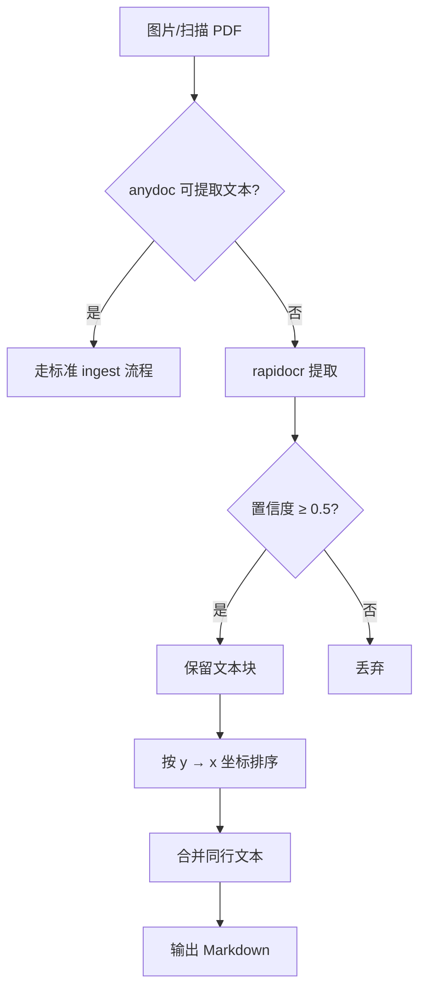

# LLM Wiki — 图片 OCR 提取

## 概述

当 anydoc 无法从图片或扫描 PDF 中提取文本时，使用 RapidOCR 进行文字识别。输出纯文本或结构化 Markdown，供 llmwiki-ingest 摄取。

> anydoc 本身不支持图片和扫描 PDF（会报 unsupported），检测到这类输入时直接走本流程，不需要先试转换。

## 工作流



## 操作步骤

### 1. 运行 RapidOCR

CLI — 单张图片快速提取：

```bash
rapidocr -img <图片路径>
```

Python API — 需要空间排序或过滤时：

```python
from rapidocr import RapidOCR
engine = RapidOCR()
result = engine("<图片路径>")
for txt, score, box in zip(result.txts, result.scores, result.boxes):
    y = (box[0][1] + box[2][1]) / 2
    x = (box[0][0] + box[2][0]) / 2
    print(f"{y:.0f}\t{x:.0f}\t{score:.3f}\t{txt}")
```

> 可视化：加 `--vis_res`（CLI）或 `result.vis("output.jpg")`（API）保存标注图，仅用于调试，不作为最终输出。

### 2. 整理输出

- 按 y 坐标升序排列文本块（y 差值 < 20px 视为同行，按 x 升序）
- 过滤置信度 < 0.5 的文本块
- 合并同一行内的相邻文本块
- 去重完全相同的文本块
- 去除无意义碎片（单字符、纯符号）

### 3. 保存为 Markdown

写入 `raw/<原文件名>.md`：

```yaml
---
title: <从 OCR 文本中提取的标题，或文件名>
tags: [ocr]
created: YYYY-MM-DD
source: raw/<原文件名>.png
---

<整理后的 OCR 文本>
```

从 OCR 文本中提取日期、标题等元数据填入 frontmatter。无明显元数据则用最小 frontmatter。

## 常见错误

| 错误 | 正确做法 |
|------|----------|
| 对纯文本 PDF 用 rapidocr | 先尝试 anydoc，失败再用 rapidocr |
| 丢弃低置信度文本 | 低置信度文本保留但标注 `[低置信度]` |
| 不做空间排序直接输出 | OCR 输出无阅读顺序，必须按 y→x 排序 |
| 把可视化图片当最终输出 | 可视化仅调试用，最终输出是文本 |

## 交叉引用

- [llmwiki-ingest](../llmwiki-ingest/SKILL.md) — 摄取流程（OCR 后继续走此流程）
- [AGENTS.md](../../AGENTS.md) — 行为规范
