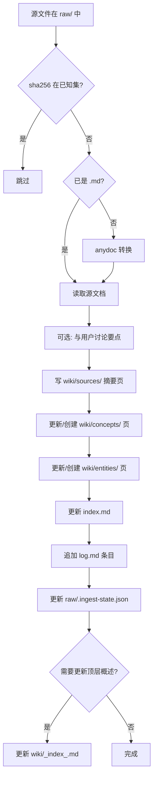
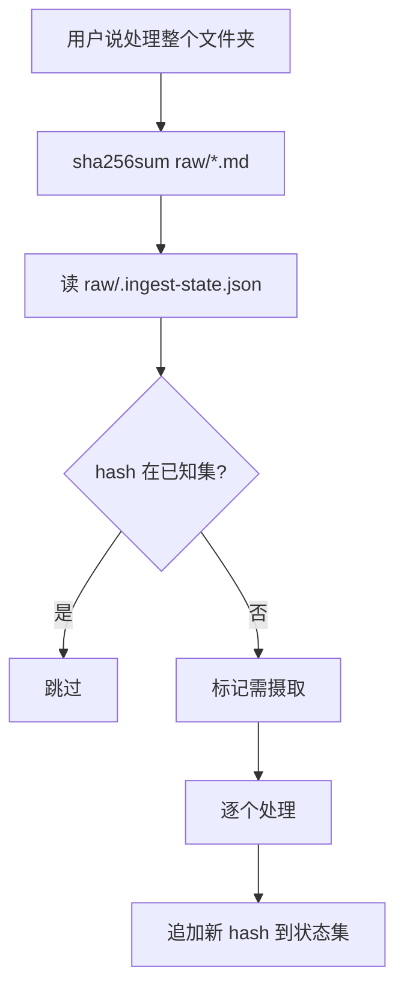

# LLM Wiki — 摄取

## 概述

将 `raw/` 中的源文档编译为 wiki 知识。读源 → 写摘要 → 更新概念/实体页 → 维护索引和日志。支持增量检测：已处理过的文件（SHA256 在状态集中）自动跳过。

## 工作流

### 单源摄入



### 批次扫描



## 增量检测（SHA256）

每次摄入时，计算文件 SHA256，判断是否已处理过。

### 状态文件

`raw/.ingest-state.json` 仅维护一个 SHA256 集合：

```json
["fa64a306e7486cb05ffc1e49201673b8986d75273561854f699138a1644cfa45"]
```

- 数组，每个元素是已处理文件的 SHA256
- 不存文件名、时间、元数据 — 纯粹哈希集合
- **工作原理**：计算文件 hash → 查是否在集合中 → 不在则摄取并加入集合

### 判断逻辑

| 场景 | Hash 在集合? | 操作 |
|------|-------------|------|
| 未处理过 | ❌ | 摄取 |
| 已处理过 | ✅ | 跳过 |
| 内容更新了(新 hash) | ❌(新) | 重新摄取 |

> 如果文件被删除，旧 hash 会留在集合中成为"幽灵"条目，但不影响功能。以后可考虑在 lint 时清理。

### 计算与比对

```bash
# 计算所有 raw 文件的 SHA256
sha256sum raw/*.md
sha256sum raw/*.pdf   # 非 .md 文件

# 或者扫全部
find raw -maxdepth 1 -type f ! -name '.*' -exec sha256sum {} +
```

比对方式（高效处理）：

```javascript
// 思路：直接用 ctx_execute 做比对，不把原始输出引入对话
const state = JSON.parse(require('fs').readFileSync('raw/.ingest-state.json','utf8'));
const known = new Set(state);
// sha256sum output: "hash  filename"
const out = require('child_process').execSync('find raw -maxdepth 1 -type f ! -name ".*" -exec sha256sum {} +','utf8');
const newFiles = out.trim().split('\n').filter(l => {
  const [hash] = l.split(/\s+/);
  return !known.has(hash);
});
console.log(`${newFiles.length} new/changed files to ingest`);
// 列出需要处理的文件名
newFiles.forEach(l => console.log(l.split(/\s+/).pop()));
```

### 批次模式

当用户说"处理 raw/ 里所有新文件"时：

1. `sha256sum` 计算 `raw/` 下所有非隐藏文件
2. 读 `raw/.ingest-state.json` 得到已知 hash 集合
3. 每条记录，hash 在集合中 → 跳过，不在 → 需要处理
4. 逐个处理新文件（每个走一遍单源摄入流程）
5. 全部完成后，把新 hash 追加到 `raw/.ingest-state.json`

## 操作步骤

### 1. 准备源文件

如果源文件不是 `.md` 格式，先用 anydoc 转换（支持 doc/docx、ppt/pptx、xls/xlsx、odt/ods/odp、rtf、epub、csv、pdf）：

```bash
anydoc raw/源文件.pdf -o raw/源文件.md
```

或使用 ingest 脚本：

```bash
./scripts/ingest.sh raw/源文件.pdf
```

> HTML 不在 anydoc 支持范围内：`ingest.sh` 会用 pandoc 自动转 GFM（`pandoc -f html -t gfm`）。若网页导航/页脚噪音多，可改用 trafilatura（`pip install trafilatura`，按正文提取，自动剥离噪音）：
>
> ```bash
> trafilatura --input-dir <html所在目录> -o <输出目录> --output-format markdown
> ```
>
> 图片/扫描 PDF 走 `llmwiki-image-ocr`（RapidOCR）流程。

> 原始文件始终保留，转换后的 `.md` 放入 `raw/` 目录。

### 2. 写源摘要

在 `wiki/sources/` 下创建摘要页，文件名与源文档对应。结构：

```yaml
---
title: 文档标题
tags: [标签]
created: YYYY-MM-DD
updated: YYYY-MM-DD
sources: [raw/源文件.md]
links: 0
---
```

内容要求：
- 元数据：标题、作者、日期、URL（如有）
- 核心论点摘要（3-5 段）
- 关键引文（标注在括号中）
- 提取的实体和概念列表（链接到 wiki 中已有页面）
- 个人思考/评论

### 3. 更新概念页

检查摘要中提及的概念：
- **已有页面** → 更新，补充新信息，标注新源
- **无页面但值得创建** → 在 `wiki/concepts/` 创建新页
- **不重要的一次提及** → 跳过

概念页结构：一句话定义 → 详细解释 → 关键属性 → 链接到其他概念 → 来源引用

### 4. 更新实体页

检查摘要中涉及的人物、作品、工具、组织：
- 更新关键事实清单
- 更新关系网络（链接到相关实体/概念）
- 添加新源引用

### 5. 更新 index.md

```
概览 → 更新已有条目的链接数、摘要
源摘要 → 添加新行
概念 → 添加/更新
实体 → 添加/更新
```

### 6. 追加 log.md

格式：

```
## [YYYY-MM-DD] ingest | 文章标题
```

每个源一行，不重复。如果同一个源涉及多个操作（先 ingest 后补充页面），追加子行。

### 7. 更新顶层概述

如果新源引入了一个全新的领域或显著改变了 wiki 的性质，更新 `wiki/_index_.md` 中的统计和导航。

### 8. 更新 raw/.ingest-state.json

将新文件的 SHA256 追加到哈希集合中（直接编辑 JSON 数组）：

```json
["已有的hash1","已有的hash2","新文件的hash"]
```

> 用 `ctx_execute` 做追加：读文件 → parse → push → stringify → 写回。

## 引用规范

- 所有从源文档提取的信息标注 `(src: raw/文件名.md)`
- 不同源对同一事实冲突时标注 `⚠️ 矛盾` 并列出双方观点
- 新源覆盖旧信息时，在旧页面顶部添加 `> [!NOTE] 此页信息已被 [新页面](path) 更新/修正`

## 常见错误

| 错误 | 正确做法 |
|------|----------|
| 修改 raw/ 下的源文件 | raw/ 下的文件只读不改，派生知识写入 wiki/ |
| 跳过 index.md 更新 | 每次 ingest 必须更新 index.md，这是 LLM 查询的入口 |
| 忘记更新关联的概念页 | 一个源可能涉及多个概念，检查所有关联 |
| 摘要写得太短 | 3-5 段，包含核心论点、引文、个人思考 |
| 不记录 log | 没有日志就无法追踪 wiki 的演进 |
| 没更新 ingest-state | 不更新 state 会导致下次批次重复处理 |

## 交叉引用

- [llmwiki-query](../llmwiki-query/SKILL.md) — 查询 wiki 内容
- [llmwiki-doctor](../llmwiki-doctor/SKILL.md) — 健康检查
- [AGENTS.md](../../AGENTS.md) — 完整的行为规范
