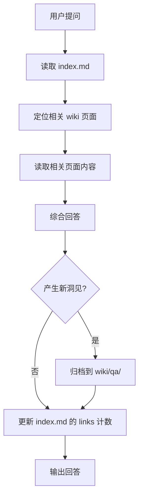

# LLM Wiki — 查询

## 概述

仅基于 wiki 中的已编译知识回答问题。不读原始文档，不使用外部知识。回答产生新洞见时归档回 wiki。

## 工作流

## 查询边界

### ✅ 允许

- 读取 `index.md` → 定位页面 → 读取 `wiki/` 下的页面
- 综合多个 wiki 页面的内容形成回答
- 回答中引用 wiki 页面路径：`[概念名](../wiki/concepts/概念名.md)`
- 标注信息来源：`(src: wiki/sources/源摘要.md)`
- 如果回答发现了新连接、新见解 → 写入 `wiki/qa/`

### ❌ 禁止

- 不读 `raw/` 下的源文件来回答问题（源只是 wiki 的基础材料，不是查询依据）
- 不使用外部知识、通用知识、训练数据来补充回答
- 不进行 web search
- 如果 wiki 中找不到相关信息，如实说"wiki 中没有相关信息，建议先摄入相关源"

## 归档到 QA

当回答产生了 wiki 中尚未捕获的见解时：

1. 在 `wiki/qa/` 创建页面，以问题或主题命名
2. 结构：
   - 问题
   - 回答摘要（含 wiki 内引用）
   - 新洞见说明
3. 同时更新相关的 `wiki/concepts/` 或 `wiki/entities/` 页面
4. 更新 `index.md` — 在 QA 归档区添加条目
5. 追加 `log.md` — `## [YYYY-MM-DD] qa | 问题摘要`

**判断标准：** 仅当回答至少有一个 wiki 中尚未明确记录的新连接、新比较、或新分析时才归档。简单的综合回答不需要归档。

## 回答格式

- 直接回答，包含对 wiki 页面的引用
- 如果涉及多个源，用表格或对比形式呈现
- 末尾注明："此回答基于 wiki 已有内容，如需补充新来源，请提供源文件。"

## 快速参考

| 场景 | 行为 |
|------|------|
| 问题在 wiki 中有明确答案 | 引用相关页面直接回答 |
| 问题需要综合多个页面 | 读所有相关页面，综合回答 |
| 问题产生新洞见 | 回答 + 归档到 wiki/qa/ |
| 问题在 wiki 中找不到 | 如实告知，建议摄入新源 |
| 问题涉及 raw/ 中的内容 | 告知已有摘要页或建议先 ingest |

## 常见错误

| 错误 | 正确做法 |
|------|----------|
| 直接读 raw/ 回答 | 只使用 wiki/ 下的已编译知识 |
| 用通用知识补充 | wiki 没有就说没有 |
| 回答不引用来源 | 每个关键点标注来源页面 |
| 忽略归档机会 | 新洞见必须写入 wiki，不能消失在对话里 |

## 交叉引用

- [llmwiki-ingest](../llmwiki-ingest/SKILL.md) — 摄入新源
- [llmwiki-doctor](../llmwiki-doctor/SKILL.md) — 健康检查
- [AGENTS.md](../../AGENTS.md) — 完整的行为规范
