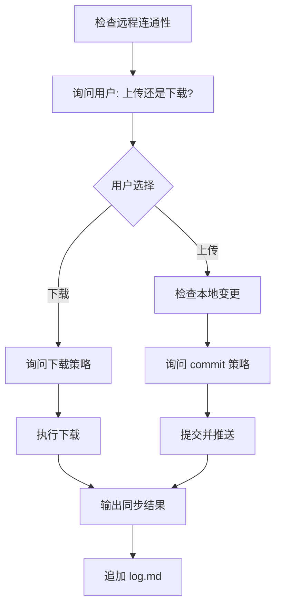

# LLM Wiki — 同步

## 概述

双向同步 wiki 仓库：上传本地变更到远程，或从远程拉取更新到本地。**每次必须询问用户方向和处理策略**，不擅自决定。

## 核心原则

**用户决定策略，LLM 执行。** 同步涉及到数据一致性和潜在冲突，必须由用户选择方向和处理方式。

## 工作流



## 步骤

### 步骤 1: 检查远程连通性

运行 `GIT_EDITOR=true git remote -v` 确认远程仓库存在。

- 如果无远程仓库 → 报告"⚠️ 没有配置远程仓库，无法同步"，停止

**完成标准：** 确认远程仓库 URL 存在。

### 步骤 2: 询问同步方向

**必须询问用户**，列举以下选项：

| 选项 | 方向 | 含义 |
|------|------|------|
| **⬆ 上传** | 本地 → 远程 | 提交本地变更并推送到远程 |
| **⬇ 下载** | 远程 → 本地 | 从远程拉取更新到本地 |

> 直接输出这两个选项让用户选择，不要替用户决定。

**完成标准：** 用户明确选择了上传或下载。

---

### ⬆ 上传分支

### 步骤 3U: 检查本地变更

运行 `git --no-optional-locks status --short` 查看本地未提交变更：

- 无变更 → 报告"✅ 本地无新变更，无需上传"
- 有变更 → 列出变更文件给用户确认

**完成标准：** 明确本地是否有需要提交的变更。

### 步骤 4U: 询问上传策略

**必须询问用户**选择提交方式：

| 策略 | 命令 | 适用场景 |
|------|------|----------|
| **① 自动提交** | `git add --all` + 自动生成 commit 消息 | 常规同步 |
| **② 手动写消息** | 用户提供自定义 commit 消息 | 需要特定期望的 commit 信息 |
| **③ 不提交，仅暂存** | 只 `git add`，不 commit | 还不确定，下次再提交 |

用户选择后：

- 策略 ① → 按下方"生成 commit 消息"规则自动生成消息
- 策略 ② → 让用户输入 commit 消息
- 策略 ③ → 执行 `git add --all`，报告"已暂存，未提交"，停止

**完成标准：** 用户确认了提交策略。

### 步骤 5U: 生成 commit 消息（策略 ① 专用）

按 Conventional Commits 格式生成中文 commit 消息：

```
<type>(<scope>): <描述>
```

| type | 适用场景 |
|------|----------|
| `feat` | 新页面/新概念 |
| `fix` | 修复错误 |
| `docs` | 文档/内容更新 |
| `chore` | 维护/同步 |
| `refactor` | 重组页面结构 |

- **scope** 固定为 `wiki`
- **描述** 中文，不超过 50 字

示例：
```
docs(wiki): 更新域安全页面的交叉引用
```

**生成后展示给用户确认**，用户可以接受或修改。

**完成标准：** commit 消息已确认。

### 步骤 6U: 提交并推送

```sh
git add --all
GIT_EDITOR=true git commit -m "<commit 消息>"
git push
```

如果 `git push` 因远程有本地没有的提交而失败（non-fast-forward）：

- **必须停下来询问用户**如何处理：
  - 策略 A: `git pull --rebase` 然后重试 `git push`
  - 策略 B: 先不处理，报告冲突让用户手动解决

**禁止**使用 `git push --force`。

**完成标准：** `git push` 成功返回。

---

### ⬇ 下载分支

### 步骤 3D: 询问下载策略

**必须询问用户**选择如何处理远程与本地差异：

| 策略 | 命令 | 风险 |
|------|------|------|
| **① 安全合并** | `git pull --rebase` | 低。本地未提交的变更会保留，有冲突需解决 |
| **② 直接覆盖本地** | `git fetch --all` → `git reset --hard origin/main` | **高。本地所有未提交变更会丢失** |
| **③ 仅查看远程变更** | `git fetch --all` + `git --no-pager log HEAD..origin/main --oneline` | 无。只看不变动 |

> ⚠️ 策略 ② 会丢弃本地所有未提交的更改。必须明确告知用户风险，得到确认后再执行。

**完成标准：** 用户确认了下载策略。

### 步骤 4D: 执行下载

按用户选择的策略执行对应命令。

**完成标准：** 命令成功返回（或冲突时报告冲突状态）。

---

### 步骤 7: 记录日志

在 `log.md` 追加：

```
## [YYYY-MM-DD] sync | <方向> — <简要描述>
```

方向填写 `上传` 或 `下载`。

**完成标准：** `log.md` 已追加同步记录。

### 步骤 8: 输出同步结果

输出以下信息：

- 同步时间
- 方向（上传/下载）
- 使用的策略
- 变更文件数
- 最终状态（成功/失败）

## 边界

### ✅ 允许

- 运行 git status、diff、fetch、add、commit、push、pull、rebase
- 修改 `log.md` 追加同步记录
- 生成并展示 commit 消息给用户确认

### ❌ 禁止

- 不询问用户就擅自决定方向或策略
- 不修改 wiki 内容页（这是 ingest/lint 的工作）
- 不修改 git 历史（rebase、reset、amend）—— 除非用户明确要求下载策略 ②
- 不使用 `git push --force`
- 不使用 `git reset --hard` —— 除非用户明确要求下载策略 ②

## 快速参考

| 场景 | 行为 |
|------|------|
| 用户说"同步" | 先问上传还是下载，再问策略 |
| 上传且无变更 | 报告后退出 |
| 上传且 push 被拒 | 报告 non-fast-forward，问用户如何处理 |
| 用户选覆盖下载 | 确认风险后执行 `git reset --hard` |
| 用户选合并下载 | 执行 `git pull --rebase` |
| 用户只想看看远程有什么 | 执行 `git fetch` + 展示差异 |

## 交叉引用

- [llmwiki-ingest](../llmwiki-ingest/SKILL.md) — 摄入新源后应同步
- [llmwiki-doctor](../llmwiki-doctor/SKILL.md) — 健康检查修复后应同步
- [AGENTS.md](../../AGENTS.md) — commit 消息格式规范
